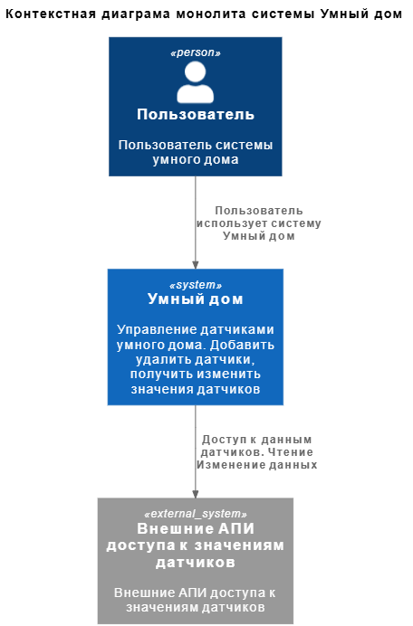
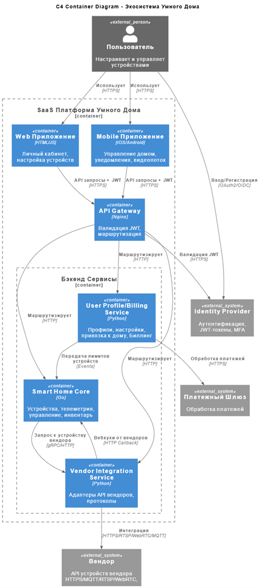
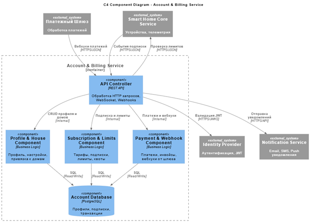
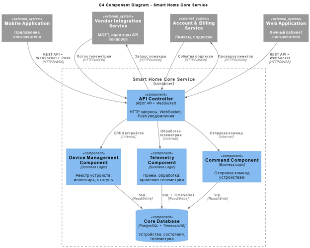
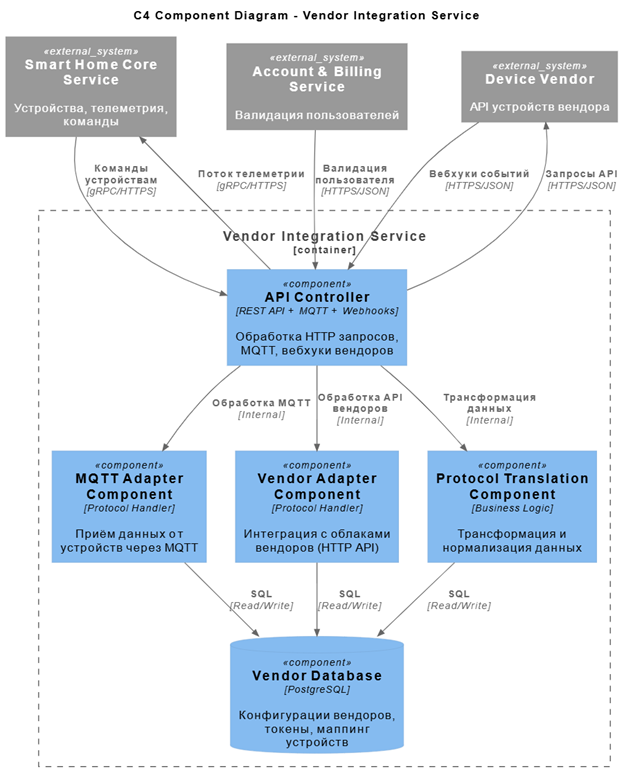
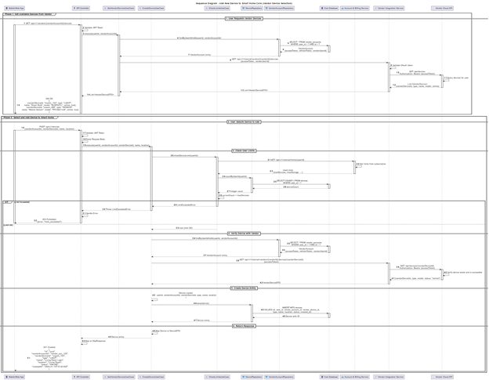
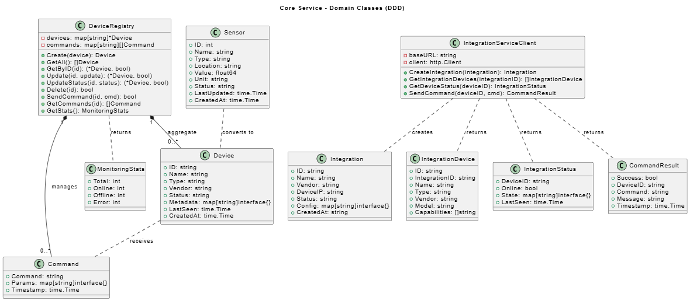
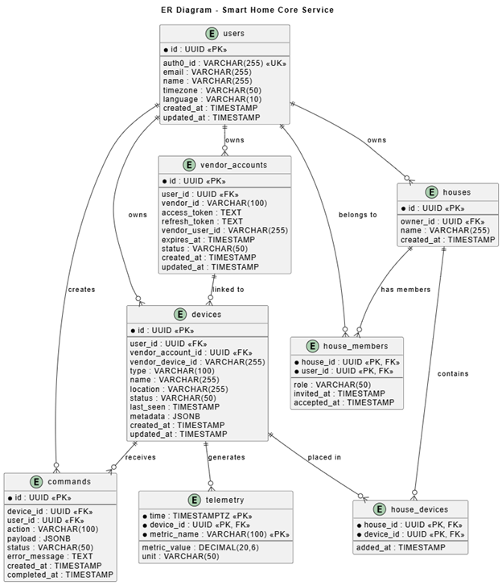

# Project_template

Это шаблон для решения проектной работы. Структура этого файла повторяет структуру заданий. Заполняйте его по мере работы над решением.

# Задание 1. Анализ и планирование

<aside>

Чтобы составить документ с описанием текущей архитектуры приложения, можно часть информации взять из описания компании и условия задания. Это нормально.

</aside

### 1. Описание функциональности монолитного приложения

**Управление отоплением:**

- Пользователи могут включать и выключать отопление. Видимо по задумке разработчиков это делается за счёт управления каким-то сенсором. Так как отдельных АПИ и функций в коде приложения я не нашёл.

**Мониторинг температуры:**

- Пользователи могут просматривать температуру в доме.
- Система поддерживает получение значений датчиков из внешних АПИ. Система поддерживает добавление и удаление датчиков.

### 2. Анализ архитектуры монолитного приложения

Перечислите здесь основные особенности текущего приложения: какой язык программирования используется, какая база данных, как организовано взаимодействие между компонентами и так далее.
1. Бэкенд приложения написан Go. В качестве http фреймворка используется Gin. Поддерживаются сигналы ОС для выключения приложения, полезно для работы в Docker
2. Используется база данных Postgres. И подход connection_pool
3. Есть 3 переменные среды.  
	- Порт на котором работает бэкенд
	- URL для опроса внешнего АПИ получения значения датчиков
	- Connection string для базы данных postgres
4. Система построена на основе слоя контроллеров, слоя внешних адаптеров, слоя моделей
5. Используется подход DI для передачи зависимостей от БД и сервиса получения данных от внешнего АПИ датчиков
6. Не хватает организации по чистой архитектуре.
7. Всё в одной горутине, не хватает распараллеливания операций для поддержки большого количества пользователей.
8. Запросы к внешнему АПИ выполняются последовательно к каждому сенсору и блокируют выполнение других операций, лучше было бы делать асинхронно.

### 3. Определение доменов и границы контекстов

Пока вижу один домен Sensors. Должен быть домен управления отоплением, но в коде я его не нашёл. Домен sensors позволяет: добавлять, удалять датчики. Получать значения и изменять значения датчиков. Даже пользовтелей нет. Т.е. тут однопользовательская система, все под одним пользователем работают и Администраторы и клиенты.

Для целевой системы я выделил следующие домены:
	1. Домен безопасности
	2. Ядро системы (ключевые функции по управлению умными устроствами)
	3. Домен интеграций с различными поставщиками. (сейчас один, открытые АПИ, но в дальнейшем может расширяться)
	4. Домен биллинга и управления учётными записями
	(объединил в один для mvp, в дальнейшем планирую использовать iam систему keycloak)

### **4. Проблемы монолитного решения**

- Всё синхронно. Медлено и плохо масштабируется на большое количество пользователей.
- Нет разделения по уровням доступам. Не безопасно.
- Структура проекта не соответствует подходам чистой архитектуры и best practices к Go проектам [Структура проекта Go best practices](https://github.com/golang-standards/project-layout)

Если вы считаете, что текущее решение не вызывает проблем, аргументируйте свою позицию.

### 5. Визуализация контекста системы — диаграмма С4


[AS-IS контекстная диаграмма](schemas/Context.puml)



# Задание 2. Проектирование микросервисной архитектуры

В этом задании вам нужно предоставить только диаграммы в модели C4. Мы не просим вас отдельно описывать получившиеся микросервисы и то, как вы определили взаимодействия между компонентами To-Be системы. Если вы правильно подготовите диаграммы C4, они и так это покажут.

**Диаграмма контейнеров (Containers)**

[Диаграмма контейнеров](schemas/Container.puml)




**Диаграмма компонентов (Components)**

## Account and Billing service

[Диаграмма компонентов Account/Billing](schemas/c4_account_billing_component.puml)



## Core service

[Диаграмма компонентов Core](schemas/c4_core_component.puml)



## Vendor integration service

[Диаграмма компонентов Vendor integration](schemas/c4_vendor_integration_component.puml)



**Диаграмма кода (Code)**

[Диаграмма последовательности Core](schemas/c4_core_sequence.puml)



[Диаграмма классов Core сервиса](schemas/core_classes.puml)



# Задание 3. Разработка ER-диаграммы

[Диаграмма сущность связь](schemas/er.puml)



# Задание 4. Создание и документирование API

### 1. Тип API

Для взаимодействия между сервисами будем использовать REST API.
Приимущества REST API:
- Легко искать проблемы, так как данные передаются в JSON
- Легко тестировать
- Поддержка в любых ЯП
- Простая и быстрая реализация, за счёт готовых фреймворков
Есть недостатки в виде больших размеров пакетов для тех же самых данных. Но на данном этапе, для нас это не критично. 
Используем шину кафка для приёма данных телеметрии с локальных домашних хабов, сборщиков/буферов. Для асинхронной обработки. Пока поддерживать будем только открытые АПИ, протоколы MQTT и т.д. предусмотрены на дальнейшее развитие системы интеграции.
### 2. Документация API

[OpenAPI документация](openapi.yml)

# Задание 5. Работа с docker и docker-compose

Перейдите в apps.

Там находится приложение-монолит для работы с датчиками температуры. В README.md описано как запустить решение.

Вам нужно:

1) сделать простое приложение temperature-api на любом удобном для вас языке программирования, которое при запросе /temperature?location= будет отдавать рандомное значение температуры.

Locations - название комнаты, sensorId - идентификатор названия комнаты

```
	// If no location is provided, use a default based on sensor ID
	if location == "" {
		switch sensorID {
		case "1":
			location = "Living Room"
		case "2":
			location = "Bedroom"
		case "3":
			location = "Kitchen"
		default:
			location = "Unknown"
		}
	}

	// If no sensor ID is provided, generate one based on location
	if sensorID == "" {
		switch location {
		case "Living Room":
			sensorID = "1"
		case "Bedroom":
			sensorID = "2"
		case "Kitchen":
			sensorID = "3"
		default:
			sensorID = "0"
		}
	}
```

2) Приложение следует упаковать в Docker и добавить в docker-compose. Порт по умолчанию должен быть 8081

3) Кроме того для smart_home приложения требуется база данных - добавьте в docker-compose файл настройки для запуска postgres с указанием скрипта инициализации ./smart_home/init.sql

Для проверки можно использовать Postman коллекцию smarthome-api.postman_collection.json и вызвать:

- Create Sensor
- Get All Sensors

Должно при каждом вызове отображаться разное значение температуры

Ревьюер будет проверять точно так же.


# **Задание 6. Разработка MVP**

Необходимо создать новые микросервисы и обеспечить их интеграции с существующим монолитом для плавного перехода к микросервисной архитектуре. 

### **Что нужно сделать**

1. Создайте новые микросервисы для управления телеметрией и устройствами (с простейшей логикой), которые будут интегрированы с существующим монолитным приложением. Каждый микросервис на своем ООП языке.
2. Обеспечьте взаимодействие между микросервисами и монолитом (при желании с помощью брокера сообщений), чтобы постепенно перенести функциональность из монолита в микросервисы. 

В результате у вас должны быть созданы Dockerfiles и docker-compose для запуска микросервисов. 